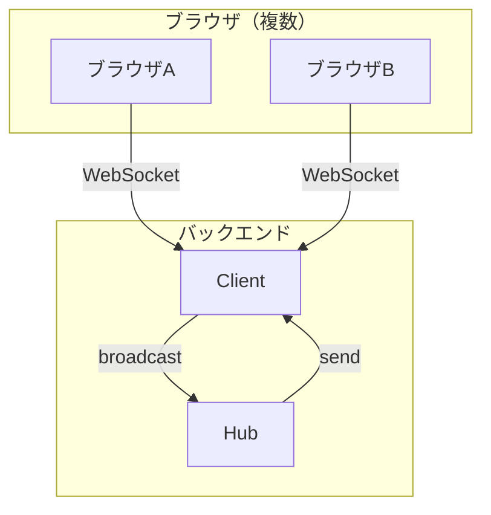

# Websocket chat

## 技術スタック
- Go 1.23
- Gin (Webフレームワーク)
- gorilla/websocket

## 機能
複数人がテキストメッセージをやりとりすることができる

## 環境構築

### 前提条件
- Go 1.23以上

### 起動手順
1.リポジトリをクローン
```bash
git clone [your-repo-url]
cd websoket-chat
```

2.依存パッケージをインストール
```bash
go mod download
```

3.サーバを起動
```bash
go run .
```
サーバは`http://localhost:8080`で起動

### 使い方
1.ブラウザで`http://localhost:8080`を開く
2.ユーザ名を入力して「設定」をクリック
3.メッセージを入力して「送信」をクリック
4.別タブを開いて同じURLを開いて複数人でチャットが可能

## ルーティング
| method | end point | describe |
| --- | --- | --- |
| GET | / | index.htmlへのルート |
| GET | /ws | websocketへの接続 |

## アーキテクチャ


## ディレクトリ構成
```
realtime-chat/
├── client.go
├── go.mod
├── go.sum
├── hub.go
├── main.go
├── README.md
├── realtime-chat.exe
└── static
    └── index.html
```

## 工夫した点
mutexでデータ競合を制御するのではなく、チャネルを経由することでgoroutineによるデータ競合を防いでいる。
mutex方式で書く場合は処理が複雑になり、Unlockの書き忘れによるデッドロック発生などが起きてしまう可能性がある。

## 今後の改善案
### セキュリティ
- XSS対策
- CSRF対策
- レート制限（メッセージ送信制限）

### 機能追加
- 複数のチャットルーム対応
- ユーザー認証
- メッセージ履歴の保存
- プライベートメッセージ

### パフォーマンス
- Ping/Pong（接続維持）
- 再接続機能
- メッセージ圧縮
